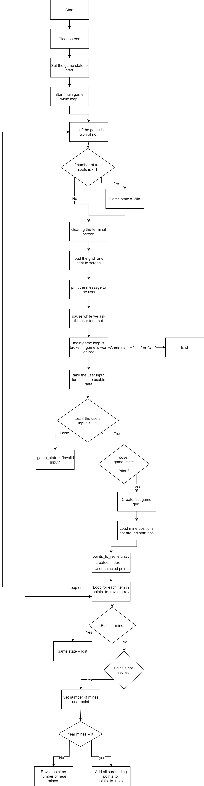

## Minesweeper

Minesweeper ruby terminal app

https://github.com/Perpaterb/minesweeper

### Minesweeper Development Plan

This is the classic windows game Minesweeper running in a terminal window using Ruby.

This application will let you play Minesweeper.

Minesweeper is a logic game where a player is shown a grid of squares with the objective to open all the squares without riding a mine under them. Each time then play the mines are in random places in the grid.

Turns out that Windows 10 doesn't come with the minesweeper by default. The aim of this terminal application is to provide entertainment and challenge players to solve the puzzle.

The target audience will be anyone wanting to solve a pimple logical puzzle without ads or get a nostalgic hit from back in the day when many working hours were wasted on Minesweeper or Solitaire. 

### How to play 

After installing see Help Installation bellow

With Gems...
run "./run_minesweeper.sh" to run the game.
run "./run_minesweeper.sh -h" or "./run_minesweeper.sh -help" to see help
run "./run_minesweeper.sh n" n = number of mines. 

Without Gems...
run "./run_nog_minesweeper.sh" to run the game.
run "./run_nog_minesweeper.sh n" n = number of mines. 

### List of features 

1. Title screen with loading bar. The title screen shows a big logon of "minesweeper" and after the loading has finished will load straight into the main game view. 

2. Display grid showing the game in the terminal window.

3. When Game is lost the game shows the player where all the mines were in red. 

4. When Game is won the game shows the player where all the mines were in magenta.

5. The player is shown an invalid input error and given a hint when there is something wrong with their input.

   

### Player interaction and experience.

1. After starting Minesweeper and waiting for it to load on the title screen. The player's blank grid will be displayed on the screen.

2. The player will be prompted with "What grid point would you like to start at? column row eg. a1 or a 1 :".

3. Entering something like "d3" with their keyboard the player will submit the starting point coordinates by hitting the enter key.

4. The screen will be refreshed and the player will then see the updated grid on their screen.

5. It is impossible for the starting point to be near or on a mine.

6. If the player was to enter anything other than an alphabetical character from (a to i) followed by a number from (1 to 9) the input would be invalid and the program will refresh the page and give the player the error "invalid input try again:  column row eg. a1 or a 1 ``. spaces and non alphanumeric characters are removed before processing the input. so "    A   !$  && 1\n" would still return "a1" and is a valid input.

7. After the starting grid point has been selected and a new updated grid displayed the player to be prompted with "What grid point do you think does not have a mine?  ".

8. The player will repeat this process until all the non mine grid points have been revealed constituting a win or a mine grid point has been selected constituting a loss.

9. If the player wins, the grid mines are all relived showing up as magenta "X"es.

10. If the player loses, the grid mines are all relived showing up as red "X"es.

    

### Flow Diagram

### Develop an implementation plan

https://trello.com/b/fpymEhEa

Display grid: Priority 1
DUE DATE: 18/12/2020
Tasks: 

- [x] Create Grid array
- [x] Create 9x9 arrays for each grid point with [row , column, state] nested in Grid array
- [x] Function to print Column indicators A-I
- [x] Function to run through each point array printing out based on the “state”
- [x] If the column is 1 in point array . print the Increasing row indicator before it.
- [x] Test

Invalid input error display: Priority 2 
DUE DATE: 18/12/2020
Tasks: 
- [x] Create Game State Var. starting, running, Invalid input, lost and win.
- [x] Message to user will depend on what Game State is.
- [x] Create Users messages for all the games state.
- [x] Get User input and remove all un wanted characters and spaces only leaving alphanumeric characters.
- [x] Check that processed User input is one a-i character followed by one int 1-9. if not Change Game start to invalid input and re-start main game loop
- [x] Test

Red X on game lost: Priority 3
DUE DATE: 18/12/2020
Tasks: 

- [x] Install colorize gem
- [x] If player picked a point that is a Mine then change Game State to Lost and re-start main game loop
- [x] If at Game start is lost then print all mine points as "X" in Red
- [x] Make sure there is a Player message for Game state lost.
- [x] Test

Magenta “X” on game win: Priority 4
DUE DATE: 18/12/2020
Tasks: 
- [x] Install colorize gem
- [x] Make function to get the number of revealed grid points
- [x] The grid is 9x9 and has 10 mines so 71 points are not mines. If revealed points = 71 that set Game state to win.
- [x] Make sure there is a User message for Game state win
- [x] Test

Title screen with loading: Priority 5
DUE DATE: 18/12/2020
Tasks: 
- [x] Install TTY Font Gem

- [x] Install ruby-progress bar

- [x] Clear terminal window

- [x] Puts "Minesweeper" is a nice big font and a colour.

- [x] Create a progress bar. add it to the screen bellow the title.

- [x] Start the progress bar running and to finish in about 3secs.

- [x] On progress bar finished Clear terminal window and start the main game.

- [x] Test

  

### Help documentation 
#### Installation
With Gems... 

1 install Ruby 2.7

2 install Bundler

3 download My Minesweeper app from git hub

4 navigate to the main Minesweeper directory

5 run "bundle install"

Without Gems...

1 install Ruby 2.7

2 download My Minesweeper app from git hub

3 navigate to the main Minesweeper directory

#### Dependencies
Ruby 2.7

Bundler to install all the Gems

Or

gem "rspec", "~> 3.10"

gem "colorize", "~> 0.8.1"

gem "tty-font", "~> 0.5.0"

gem "simple-random", "~> 1.0"

gem "ruby-progressbar", "~> 1.10"

#### System/hardware requirements
Any System that can run a Linux terminal.

#### Command Line arguments
####  Help

-help or -h

#### Number of mines 

Default 10

Enter an Integer after file path. e.g “./run_minesweeper.sh 15"

This command will run Minesweeper with 15 mines

R11 An overview of your Terminal application    The main features and overall structure of your app
R12 An overview of your code    An explanation of the important parts of your code

R13 Implement features in the software development plan you have designed. You must utilise a range of programming concepts and structures using Ruby such as:
- variables and variable scope
- loops and conditional control structures
- write and utilise simple functions
- error handling
- input and output
- importing a Ruby Gem
- using functions from a Ruby Gem
R14 Apply DRY (Don’t Repeat Yourself) coding principles to all code produced.
R15 Apply all style and conventions for the programming language consistently to all code produced.
R16 Creates an application which runs without error and has features that are consistent with the development plan.
R17 Design TWO tests which check that the application is running as expected.

Each test should:
- cover a different feature of the application
- state what is being tested
- provide at least TWO test cases and the expected results for each test case

> An outline of the testing procedure and cases should be included with the source code of the application
R18 Utilise source control throughout the development of the application by:
- making regular commits (at least 20 commits) with a commit message that summarises the changes
- pushing all commits to a remote repository
R19 Utilise developer tools to facilitate the execution of the application:
For example,
- writing a script which turns the application into an executable; OR
- packaging the application for use as a module or dependency

